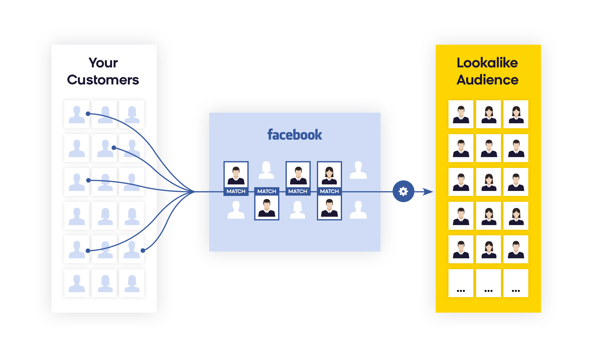
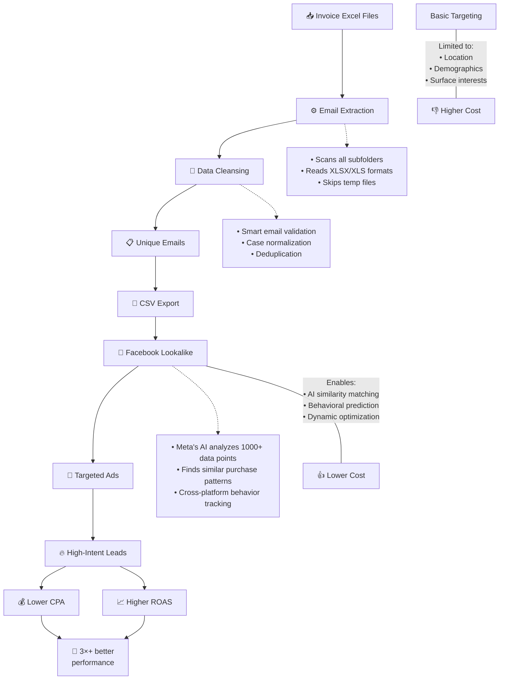

# 🔥 Customer Email Extractor → Facebook Lookalike

**Turn raw invoices into AI-powered audiences that convert.**  

This performance-focused Python tool extracts verified customer emails from sales records and feeds them into Meta’s machine learning engine — helping to reach **millions of high-intent users** who closely mirror best customers.

Perfect for scaling campaigns with **data-backed precision**, not guesswork.

🚀 **Up to 3× higher ROAS**  
🎯 **2–3× more conversions**  
💸 **50–80% lower cost per lead**
> “Lookalike Audiences built from customer emails deliver **2–3× better conversion rates** at **50–80% lower cost** than interest-based targeting.”  

⚙️ **Why it works:**  
Meta’s AI-driven matching system analyzes **1,000+ behavioral signals** — from purchase patterns to cross-platform engagement — to match your source customers with *lookalike prospects* across Facebook, Instagram, and beyond.
 
---

## Features

- 🔍 Recursive Excel file scanning (`.xlsx` and `.xls`)
- ✉️ Advanced email pattern recognition with validation
- 🧹 Automatic exclusion of temporary/backup files
- 📊 Progress tracking with real-time statistics
- ✅ Deduplication of email addresses
- 💾 CSV output with clean email formatting

---

## 🔍 How It Works

Transform raw invoice data into a high-performing Facebook Lookalike Audience — powered by Python and Meta AI.

---

### 🧾 From Invoices to Audience Targeting

The process begins by extracting verified customer email addresses from invoice records using a Python-based tool. These emails represent a **source audience** — a high-intent group of real customers who have already completed a purchase.

Once uploaded to Facebook, **Meta’s machine learning algorithms** analyze over 1,000 behavioral and demographic data points per user.  

Meta then uses this data to find statistically similar users across its platforms, creating what’s called a **Lookalike Audience** — a powerful targeting segment that mirrors the most valuable customers not by interests or job titles, but by deep behavioral signals.

**The result?**  
Broader reach with pinpoint precision, higher conversion rates, and lower customer acquisition costs — ideal for scaling ad campaigns with AI assistance, not guesswork.

---

### 🎯 Audience Size Selection (1% vs. 10%)

Facebook allows advertisers to select the **size of their Lookalike Audience**, from **1% to 10%** of the total population in a target country:

- **1% Lookalike** includes users who are **most similar** to the source audience.  
- **10% Lookalike** offers **broader reach**, but with **lower similarity**.

---

### 👥 Visualizing the Similarity Spectrum

Imagine the difference between a **1% and 10% Lookalike Audience** as two groups of lookalike models on a runway:

- The **1% group** wears nearly identical outfits and accessories — mirroring the style, preferences, and behavior of the original customers down to the smallest details.  
- The **10% group** shares some similarities but includes a much more diverse crowd with varying clothes, habits, and behaviors.

This spectrum reflects a tradeoff:

- **1% = High precision** (best for ROI and laser-focused targeting)  
- **10% = Broad exposure** (best for scaling reach quickly)

---

## Use Case

## ⚡ Why Email-Based Lookalike Audiences?

| 🧠 **Aspect**             | 😬 **Basic Targeting**             | 🚀 **Email Lookalike**                          |
|---------------------------|-------------------------------------|-------------------------------------------------|
| 📊 **Data Depth**         | ❌ Surface-level interests          | ✅ 1,000+ behavioral data points               |
| 🎯 **Precision**          | 🪤 Broad demographic groups         | 🎯 Algorithmic similarity matching             |
| 📉 **Conversion Rate**    | 🔻 ~9.2%                           | 📈 ~18–27% (2–3× lift; up to 32×)               |
| 💵 **Cost per Lead**      | 💰 $15-22                          | 💸 $3.75–6.36 (AdEspresso)                      |
| 📈 **ROAS**               | 🟡 Baseline                        | 🟢 ~3× lift; up to ~9.7×                        |

*Sources: AdEspresso, Meta Business, HubSpot*

Email-based lookalike audiences outperform basic targeting because:

- 🔍 **Meta's AI analyzes 1000+ data points per user** from your customer emails  
- 🧠 **Machine learning identifies patterns** in purchase behavior and preferences  
- 🎯 **Finds "twin audiences"** with similar characteristics to proven customers  
- 📈 **Boosts conversion rates by 2–3×** compared to interest-based targeting  
- 💰 **Cuts cost per lead by 50–80%**, based on Meta and AdEspresso benchmarks  

---

## 🚨 Key Differentiators You’re Missing Without Email Lookalikes

- 🔍 **Behavioral Prediction** – Targets users who *act* like your best customers, not just *look* like them  
- 🛒 **Purchase Intent Focus** – Zeroes in on users showing strong buying signals  
- 🤖 **Algorithmic Optimization** – Meta's AI continuously refines targeting based on conversions  
- 🌐 **Cross-Platform Insight** – Leverages the full Meta ecosystem (Instagram, WhatsApp, Facebook, etc.)
