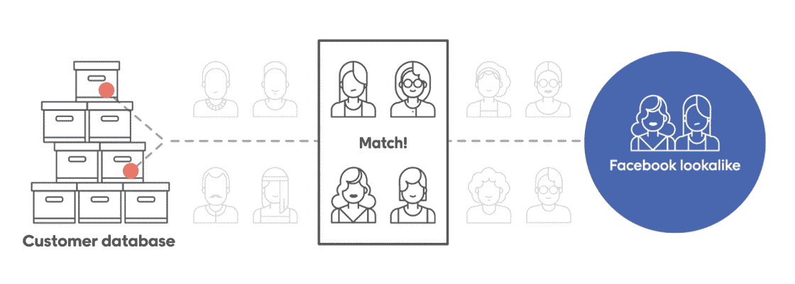
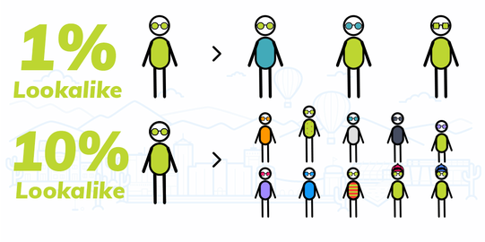

# 🔥 Customer Email Extractor → Facebook Lookalike

**Turn raw invoices into AI-powered audiences that convert.**  

This performance-focused Python tool extracts verified customer emails from sales records and feeds them into Meta’s machine learning engine — helping to reach **millions of high-intent users** who closely mirror best customers.

> “Lookalike Audiences built from customer emails deliver **2–3× better conversion rates** at **50–80% lower cost** than interest-based targeting.”  

🚀 **Up to 3× higher ROAS**  
🎯 **2–3× more conversions**  
💸 **50–80% lower cost per lead**

⚙️ **Why it works:**  
Meta’s AI-driven matching system analyzes **1,000+ behavioral signals** — from purchase patterns to cross-platform engagement — to match your source customers with *lookalike prospects* across Facebook, Instagram, and beyond.
 
Perfect for scaling campaigns with **data-backed precision**, not guesswork.

---

## Features

- 🔍 Recursive Excel file scanning (`.xlsx` and `.xls`)
- ✉️ Advanced email pattern recognition with validation
- 🧹 Automatic exclusion of temporary/backup files
- 📊 Progress tracking with real-time statistics
- ✅ Deduplication of email addresses
- 💾 CSV output with clean email formatting

---

## How It Works

### 1. Source Customer Data → Facebook Lookalike

Our tool begins by extracting **unique customer emails from invoice records** using Python. These emails form your **source audience** — a list of your existing customers. Facebook then uses this source to **find new users who closely resemble your current customers**, creating a **Lookalike Audience**.

### 2. Audience Size Selection in Facebook

Facebook allows you to select the **size of your Lookalike Audience** — ranging from **1% to 10%** of the population in your selected country.  
- **1%** includes users **most similar** to your source.
- **10%** includes a **broader audience** but with less similarity.

### 3. Similarity Spectrum: 1% vs. 10%

This visual shows how the **similarity** of Lookalike Audiences changes depending on the selected percentage:
- **1% Lookalike** = highest similarity to your source customers  
- **10% Lookalike** = wider reach, but lower similarity

---

## Use Case

## ⚡ Why Email-Based Lookalike Audiences?

| 🧠 **Aspect**             | 😬 **Basic Targeting**             | 🚀 **Email Lookalike**                          |
|---------------------------|------------------------------------|--------------------------------------------------|
| 📊 **Data Depth**         | ❌ Surface-level interests          | ✅ 1,000+ behavioral data points               |
| 🎯 **Precision**          | 🪤 Broad demographic groups         | 🎯 Algorithmic similarity matching             |
| 📉 **Conversion Rate**    | 🔻 ~9.2% average across industries | 📈 ~18–27% (2–3× lift; up to 32× in studies)    |
| 💸 **Cost per Lead**      | 💰 $15-22 industry average         | 💵 $3.75–6.36 (AdEspresso verified)             |
| 📈 **ROAS Improvement**   | 🟡 Baseline                        | 🟢 ~3× average ROAS; case example reached ~9.7× |

*Sources: AdEspresso, Meta Business, HubSpot*

Email-based lookalike audiences outperform basic targeting because:

- 🔍 **Meta's AI analyzes 1000+ data points per user** from your customer emails  
- 🧠 **Machine learning identifies patterns** in purchase behavior and preferences  
- 🎯 **Finds "twin audiences"** with similar characteristics to proven customers  
- 📈 **Boosts conversion rates by 2–3×** compared to interest-based targeting  
- 💰 **Cuts cost per lead by 50–80%**, based on Meta and AdEspresso benchmarks  

---

## 🚨 Key Differentiators You’re Missing Without Email Lookalikes

- 🔍 **Behavioral Prediction** – Targets users who *act* like your best customers, not just *look* like them  
- 🛒 **Purchase Intent Focus** – Zeroes in on users showing strong buying signals  
- 🤖 **Algorithmic Optimization** – Meta's AI continuously refines targeting based on conversions  
- 🌐 **Cross-Platform Insight** – Leverages the full Meta ecosystem (Instagram, WhatsApp, Facebook, etc.)
