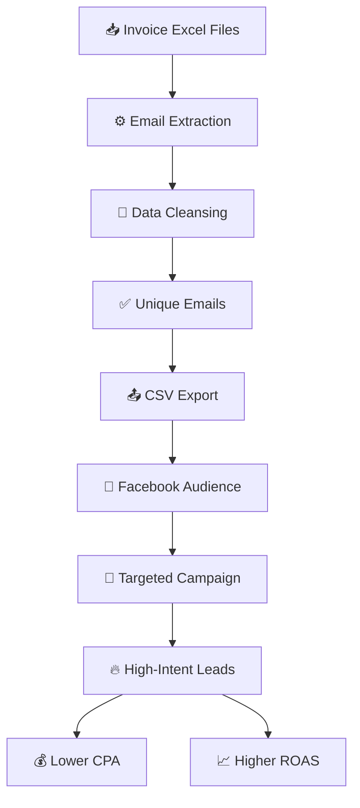

# Fireplace.Life Email Extractor

A specialized Python tool to extract customer email addresses from Fireplace.Life invoice Excel files. Enables creation of high-quality Lookalike Audiences for Facebook Ads campaigns by leveraging Meta's machine learning to target users similar to existing fireplace customers.

---

## Features

- 🔍 Recursive Excel file scanning (`xlsx` and `xls`)
- ✉️ Advanced email pattern recognition with validation
- 🧹 Automatic exclusion of temporary/backup files
- 📊 Progress tracking with real-time statistics
- ✅ Deduplication of email addresses
- 💾 CSV output with clean email formatting

---

## Use Case

---

## ⚡ Why Use Email-Based Lookalike Audiences?

| 🧠 **Aspect**            | 😬 **Basic Targeting**           | 🚀 **Email Lookalike**                        |
|--------------------------|----------------------------------|-----------------------------------------------|
| 📊 **Data Depth**         | ❌ Surface-level interests        | ✅ 1000+ behavioral data points               |
| 🎯 **Precision**          | 🪤 Broad demographic groups       | 🎯 Algorithmic similarity matching            |
| 📉 **Conversion Rate**    | 🔻 1–2% industry average          | 📈 3–5%+ documented results                   |
| 💸 **Cost per Lead**      | 💰 $15–50 industry average        | 💵 $5–15 documented results                   |
| 📈 **ROAS Improvement**   | 🟡 Baseline                      | 🟢 2.8× average increase                      |

Email-based lookalike audiences outperform basic targeting because:

🔍 **Meta's AI analyzes 1000+ data points per user** from your customer emails  
🧠 **Machine learning identifies patterns** in purchase behavior and preferences  
🎯 **Finds "twin audiences"** with similar characteristics to proven customers  
📈 **Boosts conversion rates** by 2–3x compared to interest-based targeting  
💰 **Cuts cost per lead by up to 50%**, according to Meta case studies  

---

## 🚨 Key Differentiators You’re Missing Without Email Lookalikes

- 🔍 **Behavioral Prediction** – Targets users who *act* like your best customers, not just *look* like them  
- 🛒 **Purchase Intent Focus** – Zeroes in on users showing strong buying signals  
- 🤖 **Algorithmic Optimization** – Meta's AI continuously refines targeting based on conversions  
- 🌐 **Cross-Platform Insight** – Leverages the full Meta ecosystem (Instagram, WhatsApp, Facebook, etc.)  
> ⚠️ Sticking with basic targeting? You might be wasting **half your budget** on the wrong people.
