# Fireplace.Life Email Extractor

A specialized Python tool to extract customer email addresses from Fireplace.Life invoice Excel files. Enables creation of high-quality Lookalike Audiences for Facebook Ads campaigns by leveraging Meta's machine learning to target users similar to existing fireplace customers.

## Features

- 🔍 Recursive Excel file scanning (`xlsx` and `xls`)
- ✉️ Advanced email pattern recognition with validation
- 🧹 Automatic exclusion of temporary/backup files
- 📊 Progress tracking with real-time statistics
- ✅ Deduplication of email addresses
- 💾 CSV output with clean email formatting

## ⚡ Why Use Email-Based Lookalike Audiences?

```mermaid
graph TB
    A[🎯 Targeting Options]
    
    A --> B1[😬 Basic Facebook Targeting]
    A --> B2[🚀 Email-Based Lookalike Audiences]

    %% Basic Targeting Branch
    B1 --> C1[👥 Demographics<br>Age, Gender, Location]
    B1 --> C2[🧠 Interests<br>Home Improvement, DIY, etc.]
    B1 --> C3[📉 Limited Accuracy]
    B1 --> C4[💸 Higher Cost Per Lead]

    %% Email Lookalike Branch
    B2 --> D1[🤖 Meta Machine Learning]
    B2 --> D2[📊 1000+ Data Points / User]
    B2 --> D3[🛒 Purchase Pattern Matching]
    B2 --> D4[🏆 Higher Quality Leads]
    B2 --> D5[💰 Lower Cost Per Lead]

    %% Styling
    style B1 fill:#fdd,stroke:#333,stroke-width:2px
    style B2 fill:#dfd,stroke:#333,stroke-width:2px

```

Email-based lookalike audiences outperform basic targeting because:

🔍 **Meta's AI analyzes 1000+ data points per user** from your customer emails  
🧠 **Machine learning identifies patterns** in purchase behavior and preferences  
🎯 **Finds "twin audiences"** with similar characteristics to proven customers  
📈 **Boosts conversion rates** by 2–3x compared to interest-based targeting  
💰 **Cuts cost per lead by up to 50%**, according to Meta case studies  

## ⚠️ Strategic Disadvantage of Basic Targeting vs. Email Lookalikes

| 🧠 **Aspect**            | 😬 **Basic Targeting**           | 🚀 **Email Lookalike**                        |
|--------------------------|----------------------------------|-----------------------------------------------|
| 📊 **Data Depth**         | ❌ Surface-level interests        | ✅ 1000+ behavioral data points               |
| 🎯 **Precision**          | 🪤 Broad demographic groups       | 🎯 Algorithmic similarity matching            |
| 📉 **Conversion Rate**    | 🔻 1–2% industry average          | 📈 3–5%+ documented results                   |
| 💸 **Cost per Lead**      | 💰 $15–50 industry average        | 💵 $5–15 documented results                   |
| 📈 **ROAS Improvement**   | 🟡 Baseline                      | 🟢 2.8× average increase                      |

---

## Use Case

```mermaid
graph TD
    A[📥 Invoice Excel Files] --> B[⚙️ Email Extraction]
    B --> C[🧹 Data Cleansing]
    C --> D[✅ Unique Emails]
    D --> E[📤 CSV Export]
    E --> F[👥 Facebook Audience]
    F --> G[🎯 Targeted Campaign]
    G --> H[🔥 High-Intent Leads]
    H --> I[💰 Lower CPA]
    H --> J[📈 Higher ROAS]

    %% Optional Node Styling (GitHub ignores but kept for reference)
    style A fill:#e3f2fd,stroke:#2196f3
    style B fill:#bbdefb,stroke:#2196f3
    style C fill:#90caf9,stroke:#2196f3
    style D fill:#64b5f6,stroke:#2196f3
    style E fill:#42a5f5,stroke:#2196f3
    style F fill:#2196f3,stroke:#0d47a1
    style G fill:#1976d2,stroke:#0d47a1
    style H fill:#4caf50,stroke:#2e7d32
    style I fill:#ff9800,stroke:#ef6c00
    style J fill:#ff9800,stroke:#ef6c00
```

---

## 🚨 Key Differentiators You’re Missing Without Email Lookalikes

- 🔍 **Behavioral Prediction** – Targets users who *act* like your best customers, not just *look* like them  
- 🛒 **Purchase Intent Focus** – Zeroes in on users showing strong buying signals  
- 🤖 **Algorithmic Optimization** – Meta's AI continuously refines targeting based on conversions  
- 🌐 **Cross-Platform Insight** – Leverages the full Meta ecosystem (Instagram, WhatsApp, Facebook, etc.)  
> ⚠️ Sticking with basic targeting? You might be wasting **half your budget** on the wrong people.
